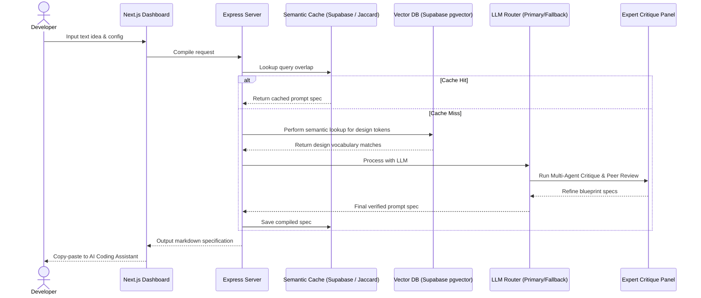
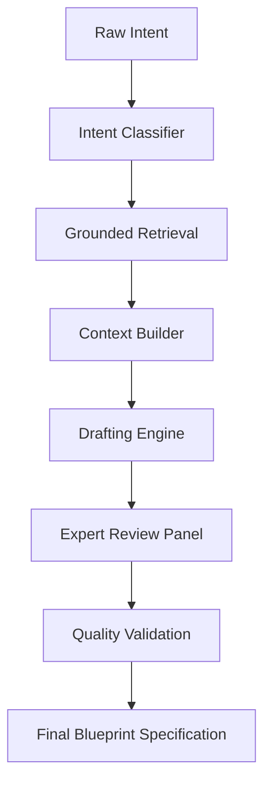

# Veyntra — AI-Powered Prompt Architecture Platform

Veyntra compiles developer intent into structured engineering specifications using AI, retrieval, and software engineering best practices.

## Overview

* **What is Veyntra?** Veyntra is an AI-Powered Prompt Architecture Platform that translates natural language product ideas into structured, framework-aligned engineering specifications.
* **Why was it built?** To eliminate the unpredictability and layout drift when building software with AI coding assistants (like Cursor, Lovable, v0, and Bolt).
* **What problem does it solve?** It bridges the gap between vague developer descriptions and precise code outputs by grounding generation in pre-configured design tokens and accessibility guidelines.
* **Who is it for?** Developers utilizing AI coding tools who need predictable, high-quality layout structures for web applications.
* **What technologies does it use?** Next.js (App Router), Node.js Express API, Supabase, PostgreSQL vector search, and multi-provider AI model orchestration.
* **Why is it technically interesting?** It implements a dynamic context-grounded retrieval engine with local fallbacks, a multi-agent critique and validation loop, semantic caches to optimize cost, and health-based AI model failover routing.

## At a Glance

| Item | Value |
| --- | --- |
| Project Type | Portfolio Project |
| Status | Feature Complete |
| Architecture | Full Stack |
| Frontend | Next.js (App Router) |
| Backend | Node.js + Express API |
| Database | PostgreSQL + Vector Similarity Search |
| AI Pipeline | Multi-provider with failover capability |
| License | MIT |

---

## Contents

* [Why Veyntra Exists](#why-veyntra-exists)
* [Why I Built This](#why-i-built-this)
* [Engineering Skills Demonstrated](#engineering-skills-demonstrated)
* [Design Philosophy](#design-philosophy)
* [The Problem](#the-problem)
* [The Solution](#the-solution)
* [What Makes Veyntra Different](#what-makes-veyntra-different)
* [Key Features](#key-features)
* [Core Capabilities](#core-capabilities)
* [Engineering Solutions](#engineering-solutions)
* [Architecture & Workflow](#architecture--workflow)
* [Performance & Reliability Optimization](#performance--reliability-optimization)
* [Screenshots](#screenshots)
* [Repository Structure](#repository-structure)
* [Tech Stack](#tech-stack)
* [Installation](#installation)
* [Environment Variables](#environment-variables)
* [Challenges & Trade-offs](#challenges--trade-offs)
* [What I Learned](#what-i-learned)
* [Current Limitations](#current-limitations)
* [Future Improvements](#future-improvements)
* [Engineering Topics Demonstrated](#engineering-topics-demonstrated)
* [Final Thoughts](#final-thoughts)
* [License](#license)
* [Author](#author)

---

## Why Veyntra Exists

Developers are increasingly utilizing AI coding assistants to generate software components, layouts, or even full-stack applications. While these code compilers are highly capable, their output is directly bound by the quality of the instructions they receive.

When developers input vague, conversational prompts, the generated code often exhibits visual inconsistencies, missing state rules, accessibility gaps, or architectural flaws. Veyntra was built to bridge this gap. Acting as a prompt architecture platform, it reads natural language descriptions and compiles them into context-rich, layout-grounded, and accessibility-compliant specifications. By feeding these blueprints directly into AI compilers, developers get predictable, consistent, and structured output on the first attempt, significantly reducing iterative manual refinement.

---

## Why I Built This

As developers build software with AI assistants, a common frustration emerges: prompt engineering is highly iterative and inconsistent. A single word difference in a prompt can lead to completely different layouts, missing styling systems, or code that ignores accessibility standards.

I built Veyntra to explore how we can apply classical compiler principles—parsing, token retrieval, translation, validation, and optimization—to generative AI prompts. By decoupling prompt engineering from manual text-writing and building a structured full-stack pipeline, this project demonstrates how to ground AI systems in design consistency, accessibility compliance, and cost-efficiency.

---

## Engineering Skills Demonstrated

For hiring managers and engineering interviewers, Veyntra showcases a complete integration of software engineering skills:

* **AI Application Architecture**: Orchestrating agentic loops and multi-step pipeline validations.
* **Retrieval-Augmented Generation (RAG)**: Grounding LLM outputs using semantic vector indexing and local fallback algorithms.
* **Full-Stack Engineering**: Implementing Next.js frontend state logic, decoupled Express APIs, and database migrations.
* **System Design & Resiliency**: Architecting model failovers and dual-layer data fallbacks for high availability.
* **Modern Frontend Architecture**: Building premium token-based styles, motion physics, and accessible page controls.
* **Database Modeling**: Querying vector columns and constructing custom similarity search SQL functions.
* **Performance Optimization**: Reducing API overhead using semantic history caching and context pruning.
* **Accessibility Standards**: Enforcing WCAG AA compliance directives programmatically.
* **Software Best Practices**: Structured logging, error boundaries, input sanitization, and clean code separation.

---

## Design Philosophy

Veyntra was designed around six core engineering principles:

* **Predictability over Randomness**: Replacing open-ended, conversational AI responses with structured, schema-validated engineering blueprints.
* **Accessibility by Default**: Programmatically injecting WCAG AA requirements (like keyboard focus loops and skip-link targets) into component specifications.
* **Consistency over Novelty**: Ensuring that the visual tokens and design rules map strictly to pre-configured systems rather than letting the model invent new ones.
* **Dynamic Data instead of Hardcoded Values**: Utilizing active database lookups and similarity indexes to ground prompt data dynamically.
* **Resilient Architecture**: Hardening the pipeline against connection issues using failovers, error catchers, and local dataset fallbacks.
* **User-First Interfaces**: Crafting premium, accessible workspaces that display metrics, templates, and history clearly to enhance the developer experience.

---

## The Problem

Building reliable software using generative AI presents several key problems:

* **Requirement Ambiguity**: Informal descriptions lack standard definitions, causing the generator to make assumptions and introduce design or logic errors.
* **Styling Divergence**: Without pre-specified visual tokens, the AI compiler selects arbitrary layout styles and colors that clash with existing systems.
* **Accessibility Gaps**: Standard generations regularly omit keyboard focus management, semantic landmarks, and proper accessibility tagging (WCAG AA standards).
* **APIs and Downtime**: Relying on single cloud model provider APIs makes systems fragile to rate limits, network delays, and database downtime.

---

## The Solution

Veyntra solves these problems by structuring the compilation flow into six key phases:

1. **Intent Analysis**: Classifies incoming inputs into specific structural scopes (application, page, component, or spec enhancement).
2. **Knowledge Retrieval**: Semantically extracts design system configurations and accessibility mappings matching the developer's request.
3. **Context Construction**: Aggregates the inputs, past chat timelines, and retrieved tokens into a single unified context.
4. **Specification Generation**: Translates context into detailed, system-aligned engineering blueprints.
5. **Validation**: Runs automated quality gates to scan for syntax issues, layout gaps, placeholder leakage, and technical leaks.
6. **Output Delivery**: Packages the validated specifications into standard markdown blueprints optimized for code compilation.

---

## What Makes Veyntra Different

* **Structured Prompt Output**: Instead of returning raw code, it outputs structured specifications designed to guide code compilers, separating prompt logic from implementation.
* **Grounded Vocabulary Retrieval**: Resolves loose design descriptions against real visual systems, ensuring color scales, layouts, and spring motion values are accurately parameterized.
* **Accessibility-Aware Specs**: Programmatically builds WCAG-compliant specifications directly into component mockups so AIs build accessible interfaces immediately.
* **Resilient Model Fallback Routing**: Monitors provider health status and swaps active APIs transparently if network errors or usage limits are encountered.
* **Zero-Cost Semantic Cache**: Bypasses AI generations for repeating or highly similar queries, delivering instant cache results and saving token resources.

---

## Key Features

### Compiler Core
* **Multi-Scale Generation**: Supports compilation scopes for whole applications, page structures, or individual interactive components.
* **Workspace Enhancement Mode**: Decomposes existing instructions and dynamically infuses design tokens and layout targets.
* **Multi-Agent Evaluation**: Automates a critique loop where expert agents audit generated blueprints and output warnings for placeholders.

### Retrieval & Grounding
* **Context Retrieval Engine**: Explores design vocabularies and layout keywords directly in the UI.
* **Category Query Boosts**: Weights search outcomes based on the workspace mode (e.g. boosting component properties during component compile).
* **Dual-Layer Search Failover**: Falls back to offline similarity lookups if database APIs are unreachable.

### Visual Workspace & Observability
* **Premium Dashboard Monitor**: Displays metrics for total lines, compilation volume, historical trends, and database status.
* **Component Forge**: Accesses pre-configured templates for SaaS landing systems, forms, authentication layouts, and profile boards.
* **Workspace Synchronization**: Configures current repository frameworks, styling options, and target libraries to align generation outcomes.

---

## Core Capabilities

* **Transform Natural Language**: Compiles unstructured developer descriptions into precise specifications.
* **Enforce Design Systems**: Grounds generated outputs using exact color tokens and visual scales.
* **Retrieve Project Knowledge**: Finds related design guidelines, terminology definitions, and layouts.
* **Improve Accessibility**: Auto-injects landmarks, focus setups, and keyboard rules.
* **Reduce Prompt Iteration**: Limits prompt refinement steps by producing structured prompts on the first run.
* **Support Multiple AI Providers**: Operates primary and secondary backup model pipelines.
* **Maintain Compilation History**: Logs generated prompt blueprints, performance metadata, and validation logs.

---

## Engineering Solutions

* **Problem**: AI code compilers generate unpredictable code and inconsistent visual rules.
  * **Solution**: Grounding prompt compilation using retrieved visual token databases.
  * **Impact**: Predictable, consistent visual layout execution matching the target design system.
* **Problem**: AI coding assistants generate code that violates accessibility laws.
  * **Solution**: Automated injection of WCAG AA compliance specifications.
  * **Impact**: Accessible applications out of the box with zero manual post-generation edits.
* **Problem**: AI provider downtime, network failures, or API rate limits disrupt developer output.
  * **Solution**: Implementing automatic model provider failover and database fallbacks.
  * **Impact**: High service availability and uninterrupted compile workflows.
* **Problem**: Regenerating prompts repeatedly increases server latency and API fees.
  * **Solution**: Semantic caching using Jaccard keyword similarity checks.
  * **Impact**: Cost optimization and near-zero latency for repeating or similar intents.

---

## Architecture & Workflow

Veyntra is built upon a decoupled full-stack model. The frontend handles interactive workspaces, while the backend executes similarity searches, orchestrates AI generation agents, and compiles final output blocks.

### System Workflow



### AI Pipeline



### Design Rationale

* **Decoupled Frontend/Backend**: Next.js focuses on rendering responsive workspaces, managing active keyboards, and spring motion libraries. Express processes heavy database computations, coordinates the multi-agent critique flow, and exposes real-time WebSocket telemetry.
* **Vector Indexing Strategy**: Uses semantic embeddings to query visual layout tokens matching developer descriptions. For performance, it implements a flat index for small datasets to avoid indexing limits of high-dimensional vectors, falling back to local text parsing when needed.
* **Fast Mode vs. Professional Mode**: Fast Mode leverages local deterministic rule templates to generate styling metrics instantly, bypassing AI token cost and latency. Professional Mode runs the full agentic loop, generating architectural blueprints using multi-agent reviews.
* **Local Offline Fallback**: If the network connection fails or the cloud database goes offline, Veyntra defaults to a local search scanning a terminology file to ensure the compiler is always operational.

---

## Performance & Reliability Optimization

Veyntra enforces efficiency and uptime through several optimization layers:

* **Semantic Cache Lookup**: Evaluates query similarity against past generations. Matching requests bypass model pipelines entirely, serving cached specifications instantly.
* **Context Pruning**: Filters retrieved knowledge fragments based on the selected workspace scope. If compiling a small component, full-stack database contexts and layout frameworks are omitted.
* **Provider Health Routing**: Monitors model status. When errors occur or rate limits are reached, the system redirects request streams to secondary models.
* **Graceful Local Fallbacks**: If the cloud database is offline, queries fall back to a local JSON terminology index, calculating term similarity using keyword-cosine overlap algorithms.
* **Automatic Cooldowns**: Flags unhealthy providers with a minute-long retry cooldown, preventing consecutive API failures from slowing down the server.

---

## Screenshots

Below is the user journey flow showing Veyntra's interface:

1. **Landing Page**
   Premium landing interface detailing the core value proposition and interactive workstation modes.
   

2. **Authentication**
   A secure authentication entry portal utilizing glassmorphic layouts.
   

3. **Dashboard Workspace**
   The developer workspace monitor displaying active metrics, prompt history lists, and system logs.
   

4. **Prompt Creation**
   The core compilation workspace where developers configure, review, and compile custom prompt specifications.
   

5. **Generated Specification**
   The compiled prompt blueprint containing design guidelines, theme specifications, and WCAG accessibility parameters.
   

6. **Component Forge**
   Boilerplate catalogs and layout templates for starting new configurations.
   

7. **Design Vocabulary**
   The database interface displaying design tokens, HSL parameters, and layout terms.
   

8. **Settings & Workspace Sync**
   Settings workspace to sync environment contexts and configure framework structures.
   

---

## Repository Structure

```
PromptForge/                  # Workspace Root
├── package.json              # Workspace-level script configurations for concurrently orchestrating servers.
├── package-lock.json         # Lockfile.
│
├── frontend/                 # Complete Next.js user interface, application routing, dashboard, and design theme context.
│   ├── src/
│   │   ├── app/              # App Router layouts, routes, pages, and API handlers.
│   │   ├── components/       # Shared design system UI widgets and visual cards.
│   │   ├── config/           # Brand styling property maps.
│   │   ├── context/          # Application-wide React states for authentication, themes, and dashboard.
│   │   ├── data/             # Offline styling dictionary assets.
│   │   ├── hooks/            # Client utility state controllers.
│   │   └── services/         # Integrations with database clients and local helper runtimes.
│   └── package.json          # Frontend packages and dependencies.
│
└── backend/                  # Manages AI agent orchestration, context building, validation pipelines, and Express API routing.
    ├── server.js             # Main server entry for endpoints, WebSocket communication, and routes.
    ├── scripts/              # Seeding utilities and database verification tools.
    ├── services/             # Core backend services for agents, retrieval, telemetry, and accessibility.
    ├── supabase/             # Database schemas, pgvector tables, migrations, and RPC similarity functions.
    └── package.json          # Backend Express, LangChain, and AI provider configurations.
```

---

## Tech Stack

* **Frontend**: Next.js 16.2 (App Router), React 19, Tailwind CSS v4, Framer Motion v12, GSAP v3, Lucide React, Sonner.
* **Backend**: Node.js, Express, WebSockets (`ws`).
* **AI Engine**: LangChain Core, Google Gemini API (Primary Model), Groq API (Fallback Model).
* **Database & Retrieval**: PostgreSQL, Supabase (with `pgvector` extension), TF-IDF (local fallback search).
* **Authentication**: Firebase Client / Supabase Auth.
* **Infrastructure**: Concurrent execution utilities (`concurrently`, `nodemon`).
* **Tooling & Validation**: Database seeding and custom prompt validation scripts.

---

## Installation

Ensure you have Node.js (v18+) installed.

1. Clone the repository:
   ```bash
   git clone https://github.com/MOULEESWARAN-25/PromptForge.git
   cd PromptForge
   ```

2. Install workspace dependencies:
   ```bash
   npm run install:all
   ```

3. Initialize the database schema:
   Run the SQL configurations in `backend/supabase/schema.sql` inside your Supabase SQL editor.

4. Seed the design vocabulary database:
   ```bash
   npm run seed
   ```

5. Launch the application:
   ```bash
   npm run dev
   ```
   * Next.js Frontend runs on `http://localhost:3000`
   * Express Backend runs on `http://localhost:8000`

---

## Environment Variables

### Frontend Setup (`frontend/.env.local`)
```env
NEXT_PUBLIC_SUPABASE_URL=https://your-project.supabase.co
NEXT_PUBLIC_SUPABASE_ANON_KEY=your-supabase-anon-key
NEXT_PUBLIC_APP_DOMAIN=localhost:3000
NEXT_PUBLIC_APP_BACKEND_DOMAIN=localhost:8000
```

### Backend Setup (`backend/.env`)
```env
SUPABASE_URL=https://your-project.supabase.co
SUPABASE_SERVICE_ROLE_KEY=your-supabase-service-role-key
GEMINI_API_KEY=your-google-gemini-api-key
GROQ_API_KEY=your-groq-api-key-optional
PORT=8000
```

---

## Challenges & Trade-offs

During development, several engineering design problems were encountered and solved:

* **Challenge**: Model outputs generate inconsistent layouts and random parameters.
  * **Why it happened**: Autoregressive text generators lack a structured grounding schema, producing arbitrary output markup formats.
  * **Options considered**:
    1. Fine-tuning a smaller custom model on specific markdown specifications.
    2. Enforcing JSON structures using output templates and running post-generation parsing validation checks.
  * **Final decision**: Option 2. Enforced JSON formatting using output schemas and ran post-generation validation checks to parse, audit, and clean the generated Markdown prompts.
  * **Trade-off**: Restricts the model's structural layout choices in exchange for compiler-aligned predictability.
* **Challenge**: Service limits and connection failures in third-party model provider APIs.
  * **Why it happened**: Cloud AI services are subject to usage rate limits and network latency bottlenecks.
  * **Options considered**:
    1. Implementing single-provider exponential backoff.
    2. Building an active model router that detects request failures and transparently swaps traffic to fallback APIs.
  * **Final decision**: Option 2. Integrated a model health tracking router that dynamically forwards payloads to backup model providers when the primary API fails.
  * **Trade-off**: Swapping to fallback models may cause slight format variances in the final prompt specifications.
* **Challenge**: Context window limits and token bloat in prompt compilation.
  * **Why it happened**: Swelling system payloads from long user histories and extensive visual libraries.
  * **Options considered**:
    1. Appending the entire token library and raw history to every prompt.
    2. Context-isolated searches, sliding context windows, and Jaccard semantic caching to prune redundant records.
  * **Final decision**: Option 2. Isolated the grounding search query by workspace mode and used Jaccard distance checks against prompt history.
  * **Trade-off**: Historical logs exceeding token thresholds are summarized or omitted from the active prompt context.
* **Challenge**: Duplicate query searches cause redundant tokens and database load.
  * **Why it happened**: Similarity checks on short keywords yield identical or overlapping results.
  * **Options considered**:
    1. Retrieving top-N nearest neighbors blindly.
    2. Custom filter thresholds and category-based query boosting.
  * **Final decision**: Option 2. Applied dynamic cosine similarity score filters and category boosts based on workspace parameters.
  * **Trade-off**: High thresholds might exclude loosely related visual helper tokens.

---

## What I Learned

| Area | What I Learned |
| --- | --- |
| AI | Prompt engineering, multi-agent evaluation structures, and provider failover implementations. |
| Backend | Decoupled API designs, local keyword fallbacks, and validation filters. |
| Frontend | Accessible UI structures, spring motion dynamics, and token-based layouts. |
| Database | similarity SQL functions, array operations, and row security configuration. |
| Engineering | Managing system limits, handling latency, and implementing performance-resiliency trade-offs. |

---

## Current Limitations

While Veyntra is feature complete, it has the following technical limitations:

* **API Dependencies**: Generation workflows rely on active cloud AI models, making completion times subject to external API response latencies.
* **Input-Dependent Quality**: The richness of the generated spec remains partially bounded by the clarity and context of the user's initial description.
* **Fixed Knowledge Base Coverage**: Visual token search capabilities depend on the diversity of visual design tokens currently seeded in the database.
* **Single-User Workspace**: Multi-user collaboration, real-time shared prompt editing, and workspace access groups are not yet supported.

---

## Future Improvements

* **Multi-Framework Syncing**: Export templates targeted at React, Vue, Svelte, and solid codebases.
* **Collaborative Shared Prompt Workspaces**: Enacting team databases and shared layouts.
* **Visual Prompt Builder**: Drag-and-drop workflow matrices to generate configurations.
* **Evaluation Datasets**: Automated benchmark test benches to track compilation accuracy over iterations.

---

## Engineering Topics Demonstrated

During interviews, I would be comfortable discussing the following areas of Veyntra:

* **Prompt Engineering**: Enforcing structural constraints to guarantee predictable output specifications.
* **Retrieval Systems**: Dynamic vector similarity query scoring, TF-IDF fallback algorithms, and category-weighted query boosts.
* **Context Management**: Sliding window historical context packing and caching optimizations.
* **AI Architecture**: Integrating multi-agent peer reviews, classification routers, and model health fallovers.
* **API Design**: Building Express routing controllers, proxying requests, and WebSocket status channels.
* **Database Modeling**: Querying high-dimensional embeddings and establishing Row-Level Security (RLS) policies.
* **Authentication**: Decoupling user session state and securing workspace routers.
* **Full-Stack Architecture**: Structuring monorepo communications and handling server environment keys.
* **Accessibility**: Conforming outputs to WCAG AA guidelines, managing focus traps, and keyboard listeners.
* **Performance Optimization**: Bypassing model computations using semantic caches and context isolation filters.
* **System Design**: Implementing dynamic routing failovers, error catchers, and monitoring.
* **Error Handling**: Establishing robust database client error handlers and API backup routines.

---

## Final Thoughts

Veyntra was built to explore how AI-assisted software development can become more predictable, structured, and production-oriented through better prompt engineering, retrieval, and software architecture. By grounding prompt inputs inside formal visual systems and validation loops, it demonstrates how agentic pipelines can bring consistency to generative AI applications.

---

## License

This project is licensed under the MIT License - see your local license documents for details.

---

## Author

* **Mouleeswaran**
  * GitHub: [MOULEESWARAN-25](https://github.com/MOULEESWARAN-25)
  * LinkedIn: [mouleeswaran](https://www.linkedin.com/in/mouleeswaran-25/)
  * Email: [mouleeswaran.contact@gmail.com](mailto:mouleeswaran.contact@gmail.com)
  * Portfolio: [mouleeswaran.dev](https://mouleeswaran.dev)
